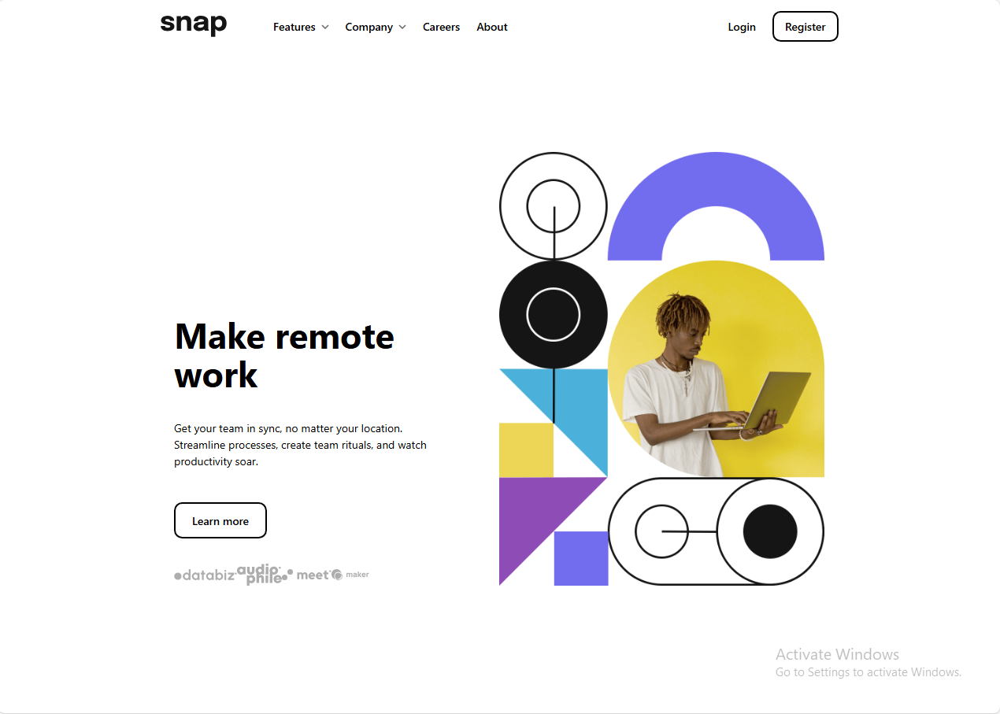

# Dropdown Navbar Solution - Frontend Mentor Challenge

## Overview

This project is a solution to the [Frontend Mentor](https://www.frontendmentor.io) challenge for creating a responsive landing page for Snap. The implementation uses modern web technologies including React, Tailwind CSS, and Vite.

## Screenshot


## Features

- **Fully responsive** layout for all device sizes
- **Interactive dropdown menus** with smooth animations
- **Mobile-first design** approach
- **Performance optimized** assets and code
- **Clean, maintainable** React component structure

## Installation

1. Clone the repository:
```bash
git clone https://github.com/AbdulrahmanFrontend/dropdown-navbar-solution
```
2. Install dependencies:
```bash
cd dropdown-navbar-solution
npm install
```
3. Start development server:
```bash
npm run dev
```

## Project Structure
```text
src/
├── components/
│   ├── Navbar.jsx       # Main navigation component
│   ├── MobileMenu.jsx   # Mobile navigation drawer
│   ├── HeroSection.jsx  # Main hero content
│   └── ClientLogos.jsx  # Client logo showcase
├── App.jsx              # Main application component
├── main.jsx             # Entry point
└── App.css              # Global styles
public/                  # Static assets
```

## Technologies Used
- [React](https://react.dev/) - JavaScript library for building UIs
- [TailwindCSS](https://tailwindcss.com/) - Utility-first CSS framework
- [Vite](https://vite.dev/) - Fast build tool
- [Git](https://git-scm.com/) - Version control

## How It Works
1. The responsive navbar automatically switches between desktop and mobile views
2. Dropdown menus are implemented with React state management
3. Hero section adapts its layout based on screen size
4. Client logos section displays partner brands

## Customization
To modify the content:
1. Update text in the respective components
2. Replace images in /public/images

## Credits
- Design provided by Frontend Mentor
- Fonts from Google Fonts

## License
This project is open source and available under the [MIT](LICENSE).